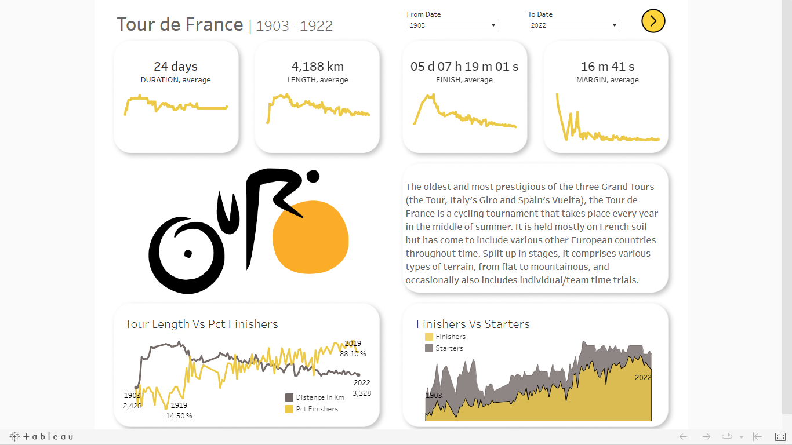
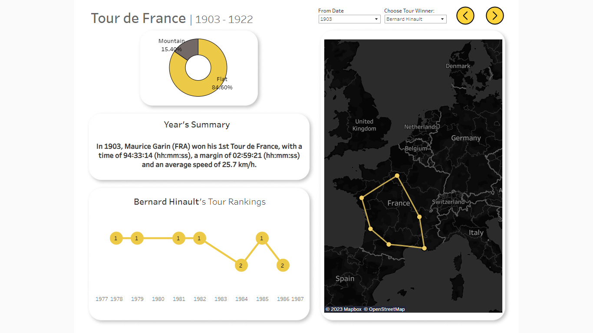
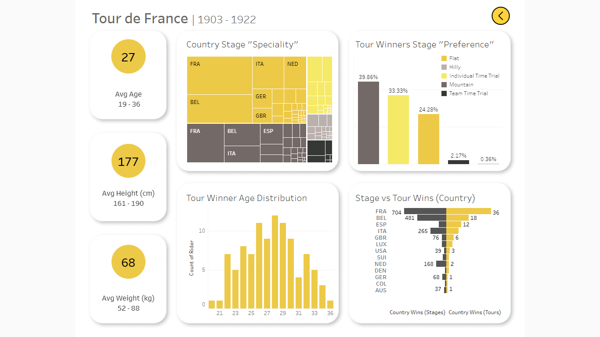

# Tour de France


## 📚  Table of Contents
- [📄 Importing the datasets (SQL)](https://github.com/mihaivlasceanu/Tour-de-France/blob/main/README.md#importing-the-datasets)
- [🧹 Cleaning the tables (SQL & Python)](https://github.com/mihaivlasceanu/Tour-de-France/blob/main/README.md#cleaning-the-tables)
- [🔍 Exploratory Data Analysis (SQL)](https://github.com/mihaivlasceanu/Tour-de-France/blob/main/README.md#exploratory-data-analysis)
- [🎨 Data Visualization (Tableau)](https://github.com/mihaivlasceanu/Tour-de-France/blob/main/README.md#data-visualization)

## Importing the datasets
**Source:** [Maven Analytics](https://mavenanalytics.io/data-playground)
```sql
CREATE TABLE tours (
year INT,
dates TEXT,
stages TEXT,
distance TEXT,
starters INT,
finishers INT
)

SELECT * FROM tours
LIMIT 5

-- \COPY tours FROM 'C:\Users\Public\tdf_tours.csv' WITH CSV HEADER DELIMITER ','
```
| year | dates                  | stages | distance            | starters | finishers |
|------|------------------------|--------|---------------------|----------|-----------|
| 1903 | 1–19 July 1903         | 6      | 2,428 km (1,509 mi) | 60       | 21        |
| 1904 | 2–24 July 1904         | 6      | 2,428 km (1,509 mi) | 88       | 15        |
| 1905 | 9–30 July 1905         | 11     | 2,994 km (1,860 mi) | 60       | 24        |
| 1906 | 4–29 July 1906         | 13     | 4,637 km (2,881 mi) | 82       | 14        |
| 1907 | 8 July – 4 August 1907 | 14     | 4,488 km (2,789 mi) | 93       | 33        |

```sql
CREATE TABLE winners (
year INT,
country TEXT,
rider TEXT,
team TEXT,
time TEXT,
margin TEXT,
stages_won INT,
stages_led INT,
avg_speed TEXT,
height TEXT,
weight TEXT,
born DATE,
died DATE
)

SELECT * FROM winners
LIMIT 5

-- \COPY winners FROM 'C:\Users\Public\tdf_winners.csv' WITH CSV HEADER DELIMITER ','
```
| year | country | rider               | team           | time        | margin       | stages_won | stages_led | avg_speed | height | weight | born       | died       |
|------|---------|---------------------|----------------|-------------|--------------|------------|------------|-----------|--------|--------|------------|------------|
| 1903 | France  | Maurice Garin       | La Française   | 94h 33' 14" | + 2h 59' 21" | 3          | 6          | 25.7km/h  | 1.62m  | 60kg   | 1871-03-03 | 1957-02-19 |
| 1904 | France  | Henri Cornet        | Conte          | 96h 05' 55" | + 2h 16' 14" | 1          | 3          | 25.3km/h  |        |        | 1884-08-04 | 1941-03-18 |
| 1905 | France  | Louis Trousselier   | Peugeot–Wolber |             |              | 5          | 10         |           |        |        | 1881-06-29 | 1939-04-24 |
| 1906 | France  | René Pottier        | Peugeot–Wolber |             |              | 5          | 12         |           |        |        | 1879-06-05 | 1907-01-25 |
| 1907 | France  | Lucien Petit-Breton | Peugeot–Wolber |             |              | 2          | 5          |           |        |        | 1882-10-18 | 1917-12-20 |

```sql
CREATE TABLE stages (
year INT,
date DATE,
stage TEXT,
course TEXT,
distance TEXT,
type TEXT,
winner TEXT
)

SELECT * FROM stages
LIMIT 5

-- \COPY stages FROM 'C:\Users\Public\tdf_stages.csv' WITH CSV HEADER DELIMITER ',' ENCODING 'UTF8'
```
| year | date       | stage | course                | distance        | type                   | winner                      |
|------|------------|-------|-----------------------|-----------------|------------------------|-----------------------------|
| 1903 | 1903-07-01 | 1     | Paris to Lyon         | 467 km (290 mi) | Plain stage            | Maurice Garin (FRA)         |
| 1903 | 1903-07-05 | 2     | Lyon to Marseille     | 374 km (232 mi) | Stage with mountain(s) | Hippolyte Aucouturier (FRA) |
| 1903 | 1903-07-08 | 3     | Marseille to Toulouse | 423 km (263 mi) | Plain stage            | Hippolyte Aucouturier (FRA) |
| 1903 | 1903-07-12 | 4     | Toulouse to Bordeaux  | 268 km (167 mi) | Plain stage            | Charles Laeser (SUI)        |
| 1903 | 1903-07-13 | 5     | Bordeaux to Nantes    | 425 km (264 mi) | Plain stage            | Maurice Garin (FRA)         |
```sql
CREATE TABLE finishers (
year INT,
rank TEXT,
rider TEXT,
time TEXT,
team TEXT
)
 
SELECT * FROM finishers
LIMIT 5

-- \COPY finishers FROM 'C:\Users\Public\tdf_finishers.csv' WITH CSV HEADER DELIMITER ',' ENCODING 'UTF8'
```
| year | rank | rider                    | time         | team         |
|------|------|--------------------------|--------------|--------------|
| 1903 | 1    | Maurice Garin (FRA)      | 94h 33' 14"  | La Française |
| 1903 | 2    | Lucien Pothier (FRA)     | + 2h 59' 21" | La Française |
| 1903 | 3    | Fernand Augereau (FRA)   | + 4h 29' 24" | La Française |
| 1903 | 4    | Rodolfo Muller[27] (ITA) | + 4h 39' 30" | La Française |
| 1903 | 5    | Jean Fischer (FRA)       | + 4h 58' 44" | La Française |

## Cleaning the tables
**1. TOURS table**
- split *dates* column into *start_date* and *end_date*, ensured columns' consistency and converted to date
- kept only the numeric value of *distance* in km and removed the one in miles
- created new column *pct_finishers* out of the *starters* and *finishers* columns
```sql
WITH tours_1 AS(
SELECT 
year,
TRIM(REPLACE(dates, RIGHT(dates,4),'')) as days,
stages,
SPLIT_PART(distance,' ',1) as distance_in_km,
starters, 
finishers
FROM tours 
)
	
, tours_2 AS (
SELECT
year,
days,
TRIM(REPLACE((REGEXP_REPLACE(days,'[–—]','-')),'202','2020')) as new_days,
stages,
TRIM(REPLACE(REPLACE(distance_in_km, RIGHT(distance_in_km,3),''),',',''))::numeric as distance_in_km,
starters, 
finishers,
ROUND(1.0*finishers/starters*100,1) as pct_finishers
FROM tours_1
)
	
, tours_3 AS (
SELECT
year,
new_days,
SPLIT_PART(new_days,'-', 1) as starting_date,
SPLIT_PART(new_days,'-', 2) as ending_date,
stages,
distance_in_km,
starters, 
finishers,
pct_finishers
FROM tours_2
)
	
, tours_4 AS (
SELECT
year, 
new_days,
SPLIT_PART(TRIM(starting_date),' ',1) as starting_day,
CASE WHEN SPLIT_PART(TRIM(starting_date),' ',2) = '' THEN SPLIT_PART(TRIM(ending_date),' ',2) END as starting_month,
SPLIT_PART(TRIM(ending_date),' ',1) as ending_day,
SPLIT_PART(TRIM(ending_date),' ',2) as ending_month,
stages,
distance_in_km,
starters, 
finishers,
pct_finishers
FROM tours_3
)
	
, tours_5 AS (
SELECT
year, 
new_days,
starting_day,
CASE WHEN starting_month IS NULL AND ending_month = 'July' THEN 'June'
WHEN starting_month IS NULL AND ending_month = 'August' THEN 'July'
WHEN starting_month IS NULL AND ending_month = 'September' THEN 'August'
ELSE starting_month END as starting_month,
ending_day,
ending_month,
stages,
distance_in_km,
starters, 
finishers,
pct_finishers
FROM tours_4
)
	
SELECT
year,
TO_DATE(starting_day||' '||starting_month||' '||year,'DD Month YYYY') as start_date,
TO_DATE(ending_day||' '||ending_month||' '||year, 'DD Month YYYY') as end_date,
stages,
distance_in_km,
starters, 
finishers,
pct_finishers
INTO tours_cleaned
FROM tours_5

SELECT * FROM tours_cleaned
LIMIT 5
```
| year | start_date | end_date   | stages | distance_in_km | starters | finishers | pct_finishers |
|------|------------|------------|--------|----------------|----------|-----------|---------------|
| 1903 | 1903-07-01 | 1903-07-19 | 6      | 2428           | 60       | 21        | 35.0          |
| 1904 | 1904-07-02 | 1904-07-24 | 6      | 2428           | 88       | 15        | 17.0          |
| 1905 | 1905-07-09 | 1905-07-30 | 11     | 2994           | 60       | 24        | 40.0          |
| 1906 | 1906-07-04 | 1906-07-29 | 13     | 4637           | 82       | 14        | 17.1          |
| 1907 | 1907-07-08 | 1907-08-04 | 14     | 4488           | 93       | 33        | 35.5          |

**2. WINNERS table**
- removed punctuation and unnecessary characters for the *time* and *margin* columns and converted to a more appropriate format (interval, in this case)
- fix the spelling for several names in the *rider* column (Excel)
- removed non-numeric characters for *avg_speed*, *height* and *weight* columns
```sql
WITH winners_1 AS (
SELECT 
year,
country,
CASE WHEN rider='Tadej Poga?ar' THEN 'Tadej Pogačar' ELSE rider END AS rider,
team,
REPLACE(TRIM(SPLIT_PART(time,' ',1)),'h','') AS time_hours,
REGEXP_REPLACE(TRIM(SPLIT_PART(time,' ',2)),'[^\w\s]','') as time_minutes,
REGEXP_REPLACE(TRIM(SPLIT_PART(time,' ',3)),'[^\w\s]','')AS time_seconds,
margin,
CASE WHEN LENGTH(margin)=12 THEN '0'||TRIM(SPLIT_PART(margin,' ',2)) END as margin_hours,
CASE WHEN LENGTH(margin)=12 THEN TRIM(SPLIT_PART(margin,' ',3))
	 WHEN LENGTH(margin)=9 THEN TRIM(SPLIT_PART(margin,' ',2))
     WHEN LENGTH(margin)=8 THEN '0'||TRIM(SPLIT_PART(margin,' ',2)) END as margin_minutes,
CASE WHEN LENGTH(margin)=12 THEN TRIM(SPLIT_PART(margin,' ',4))
	 WHEN LENGTH(margin)=9 THEN TRIM(SPLIT_PART(margin,' ',3))
     WHEN LENGTH(margin)=8 THEN TRIM(SPLIT_PART(margin,' ',3))
	 WHEN LENGTH(margin)=5 THEN TRIM(SPLIT_PART(margin,' ',2)) 
     WHEN LENGTH(margin)=4 THEN '0'||TRIM(SPLIT_PART(margin,' ',2)) END as margin_seconds,
stages_won,
stages_led,
REPLACE(avg_speed,'km/h','') AS avg_speed_kmph,
REPLACE(height,'m','') AS height_metres,
REPLACE(weight,'kg','') AS weight_kg,
born,
died
FROM winners
)
	
, winners_2 AS (
SELECT
year,
country,
rider,
team,
NULLIF(time_hours,'')::int as time_hours,
NULLIF(time_minutes,'')::int as time_minutes,
NULLIF(time_seconds,'')::int as time_seconds,
NULLIF(REPLACE(margin_hours,'h',''),'')::int as margin_hours,
NULLIF(REGEXP_REPLACE(margin_minutes,'[^\w\s]','','g'),'')::int as margin_minutes,
NULLIF(REGEXP_REPLACE(margin_seconds,'[^\w\s]','','g'),'')::int as margin_seconds,
stages_won,
stages_led,
avg_speed_kmph::numeric,
REPLACE(height_metres,'.','')::int as height_cm,
weight_kg::int,
born,
died
FROM winners_1
)
	
, winners_3 AS (
SELECT 
year,
country,
rider,
team,
MAKE_INTERVAL(hours=>time_hours, mins=>time_minutes, secs=>time_seconds) as time_cleaned,
MAKE_INTERVAL(hours=>COALESCE(margin_hours,0), mins=>COALESCE(margin_minutes,0), secs=>COALESCE(margin_seconds,0)) as margin_cleaned,
stages_won,
stages_led,
avg_speed_kmph,
height_cm,
weight_kg,
born,
died
FROM winners_2
)
	
SELECT
year,
country,
rider,
team,
time_cleaned,
NULLIF(margin_cleaned,INTERVAL '00:00:00') as margin_cleaned,
time_cleaned-margin_cleaned as time_of_next_rider,
stages_won,
stages_led,
avg_speed_kmph,
height_cm,
weight_kg,
born,
died
INTO winners_cleaned
FROM winners_3

SELECT * FROM winners_cleaned
LIMIT 5
```
| year | country | rider               | team           | time_cleaned | margin_cleaned | time_of_next_rider | stages_won | stages_led | avg_speed_kmph | height_cm | weight_kg | born       | died       |
|------|---------|---------------------|----------------|--------------|----------------|--------------------|------------|------------|----------------|-----------|-----------|------------|------------|
| 1903 | France  | Maurice Garin       | La Française   | 94:33:14     | 02:59:21       | 91:33:53           | 3          | 6          | 25.7           | 162       | 60        | 1871-03-03 | 1957-02-19 |
| 1904 | France  | Henri Cornet        | Conte          | 96:05:55     | 02:16:14       | 93:49:41           | 1          | 3          | 25.3           |           |           | 1884-08-04 | 1941-03-18 |
| 1905 | France  | Louis Trousselier   | Peugeot–Wolber |              |                |                    | 5          | 10         |                |           |           | 1881-06-29 | 1939-04-24 |
| 1906 | France  | René Pottier        | Peugeot–Wolber |              |                |                    | 5          | 12         |                |           |           | 1879-06-05 | 1907-01-25 |
| 1907 | France  | Lucien Petit-Breton | Peugeot–Wolber |              |                |                    | 2          | 5          |                |           |           | 1882-10-18 | 1917-12-20 |

**3. STAGES table**
- split *course* column into *starting_point* and *ending_point*
- added the corresponding country for each city/town
- updated countries with their contemporary names (e.g. from "West Germany" to "Germany")
- identified and updated cities and towns that had changed their names over the years
- removed non-numeric characters from the *distance* column
- reassigned the stage types to fewer and more consistent buckets (Flat, Hilly, Mountain, Individual Time Trial, Team Time Trial)
- split the *winner* column into separate *winner* and corresponding *nationality* columns
- enriched the dataset with coordinates for the starting and ending locations of each stage (Python)
```sql
WITH stages_1 AS (
SELECT
year,
date,
stage,
REGEXP_REPLACE(course,'West Germany', 'Germany','g') as course,
SPLIT_PART(distance,' ',1)::numeric as distance_in_km,
CASE WHEN type IN ('Flat','Flat stage','Flat Stage','Plain stage with cobblestones','Flat cobblestone stage','Plain stage','Half Stage') THEN 'Flat'
	 WHEN type IN ('Hilly stage','Hilly Stage','Intermediate stage','Transition stage') THEN 'Hilly'
	 WHEN type IN ('High mountain stage','Mountain Stage','Medium mountain stage[c]','Mountain Stage (s)','Medium-mountain stage','Mountain stage','Medium mountain stage','Stage with mountains','Stage with mountain(s)','Stage with mountain') THEN 'Mountain'
	 WHEN type IN ('Mountain time trial','Individual time trial') THEN 'Individual Time Trial' 
	 WHEN type = 'Team time trial' THEN 'Team Time Trial' END as type,
REGEXP_REPLACE(winner,'[\s]*\([A-Z]+\)','','g') as winner,
TRIM(BOTH '()' FROM ARRAY_TO_STRING(REGEXP_MATCHES(winner,'\([A-Z]+\)|$'),'')) as nationality
FROM stages
)

, stages_2 AS (
SELECT 
year,
date,
stage,
course,
distance_in_km,
type,
ARRAY_TO_STRING(REGEXP_MATCH(winner,'[\w]*[-–''\s.]*[\w]*[-–''\s.]*[\w]*[-–''\s.]*[\w]*'),'') as winner, -- solution to get rid of an extra character that TRIM would not solve (also, some last names had a '-')
nationality
FROM stages_1
)

SELECT
year,
date,
stage,
course,
distance_in_km,
type,
CASE WHEN winner = 'Cancelled and replaced by' THEN 'TI–Raleigh–Campagnolo' ELSE winner END as winner,
CASE WHEN winner = 'Switzerland' THEN 'SUI'
WHEN winner = 'Netherlands' THEN 'NED' 
WHEN winner = 'France' THEN 'FRA'
WHEN winner IN ('Belgium','Belgium A') THEN 'BEL'
ELSE nationality END as nationality
INTO stages_cleaned
FROM stages_2


SELECT * FROM stages_cleaned
LIMIT 5
```
| year | date       | stage | course                | distance_in_km | type     | winner                | nationality |
|------|------------|-------|-----------------------|----------------|----------|-----------------------|-------------|
| 1903 | 1903-07-01 | 1     | Paris to Lyon         | 467            | Flat     | Maurice Garin         | FRA         |
| 1903 | 1903-07-05 | 2     | Lyon to Marseille     | 374            | Mountain | Hippolyte Aucouturier | FRA         |
| 1903 | 1903-07-08 | 3     | Marseille to Toulouse | 423            | Flat     | Hippolyte Aucouturier | FRA         |
| 1903 | 1903-07-12 | 4     | Toulouse to Bordeaux  | 268            | Flat     | Charles Laeser        | SUI         |
| 1903 | 1903-07-13 | 5     | Bordeaux to Nantes    | 425            | Flat     | Maurice Garin         | FRA         |

**Splitting course column into "starting point", "starting_country", "ending_point", "ending_country":**
```sql
WITH course_split AS (
SELECT 
year, 
date, 
stage, 
SPLIT_PART(course,' to ', 1) as starting_point,
SPLIT_PART(course,' to ', 2) as ending_point,
distance_in_km, 
type, 
winner, 
nationality
FROM stages_cleaned
)

, country_ident AS (
SELECT
year, 
date, 
stage, 
starting_point,
REGEXP_MATCH(starting_point,'\([\w]+\)|\([\w]+ [\w]+\)') as starting_country,
ending_point,
REGEXP_MATCH(ending_point,'\([\w]+\)|\([\w]+ [\w]+\)') as ending_country,
distance_in_km, 
type, 
winner, 
nationality
FROM course_split
)

, cleaned_countries AS (
SELECT
year, 
date, 
stage, 
starting_point,
TRIM(BOTH '()'FROM ARRAY_TO_STRING(starting_country,'')) as starting_country,
ending_point,
TRIM(BOTH '()' FROM ARRAY_TO_STRING(ending_country,'')) as ending_country,
distance_in_km, 
type, 
winner, 
nationality
FROM country_ident	
)

, fill_end_point AS (
SELECT
year, 
date, 
stage, 
starting_point,
starting_country,
CASE WHEN ending_point='' THEN starting_point ELSE ending_point END as ending_point,
ending_country,
distance_in_km, 
type, 
winner, 
nationality	
FROM cleaned_countries
)

, final_table AS (
SELECT
year, 
date, 
stage, 
REGEXP_REPLACE(starting_point,'\([\w]+\)|\([\w]+ [\w]+\)','') as starting_point,
CASE WHEN starting_country IS NULL THEN 'France' ELSE TRIM(BOTH '()' FROM ARRAY_TO_STRING(REGEXP_MATCH(starting_point,'\([\w]+\)|\([\w]+ [\w]+\)'),'')) END as starting_country,
REGEXP_REPLACE(ending_point,'\([\w]+\)|\([\w]+ [\w]+\)','') as ending_point,
CASE WHEN REGEXP_MATCH(ending_point,'\([\w]+\)|\([\w]+ [\w]+\)') IS NOT NULL THEN TRIM(BOTH '()' FROM ARRAY_TO_STRING(REGEXP_MATCH(ending_point,'\([\w]+\)|\([\w]+ [\w]+\)'),'')) ELSE 'France' END as ending_country,
distance_in_km, 
type, 
winner, 
nationality	
FROM fill_end_point
)

SELECT
*
INTO stages_cleaned_2
FROM final_table

SELECT * FROM stages_cleaned_2
LIMIT 5

-- \COPY stages_cleaned_2 TO 'C:\Users\Public\tdf_stages_2.csv' WITH CSV HEADER DELIMITER ',' ENCODING 'UTF8'
```
| year | date       | stage | starting_point | starting_country | ending_point | ending_country | distance_in_km | type     | winner                | nationality |
|------|------------|-------|----------------|------------------|--------------|----------------|----------------|----------|-----------------------|-------------|
| 1903 | 1903-07-01 | 1     | Paris          | France           | Lyon         | France         | 467            | Flat     | Maurice Garin         | FRA         |
| 1903 | 1903-07-05 | 2     | Lyon           | France           | Marseille    | France         | 374            | Mountain | Hippolyte Aucouturier | FRA         |
| 1903 | 1903-07-08 | 3     | Marseille      | France           | Toulouse     | France         | 423            | Flat     | Hippolyte Aucouturier | FRA         |
| 1903 | 1903-07-12 | 4     | Toulouse       | France           | Bordeaux     | France         | 268            | Flat     | Charles Laeser        | SUI         |
| 1903 | 1903-07-13 | 5     | Bordeaux       | France           | Nantes       | France         | 425            | Flat     | Maurice Garin         | FRA         |

**This new file (tdf_stages_2) we will enrich with location coordinates using Python, thus producing tdf_stages_3.**

[🐍 Click here to check out the Jupyter Notebook for this step!](https://github.com/mihaivlasceanu/Tour-de-France/blob/main/tdf_geocoding.ipynb)

```sql
CREATE TABLE stages_cleaned_3 (
year INT,
date DATE,
stage TEXT,
starting_point TEXT,
starting_country TEXT,
ending_point TEXT, 
ending_country TEXT,
distance_in_km NUMERIC,
type TEXT,
winner TEXT,
nationality TEXT,
full_starting_point TEXT,
starting_lat NUMERIC,
starting_long NUMERIC,
full_ending_point TEXT,
ending_lat NUMERIC,
ending_long NUMERIC	
)

-- \COPY stages_cleaned_3 FROM 'C:\Users\Public\tdf_stages_3.csv' WITH CSV HEADER DELIMITER ',' ENCODING 'UTF8'

SELECT * FROM stages_cleaned_3
LIMIT 5
```
| year | date       | stage | starting_point | starting_country | ending_point | ending_country | distance_in_km | type     | winner                | nationality | full_starting_point | starting_lat | starting_long | full_ending_point | ending_lat  | ending_long  |
|------|------------|-------|----------------|------------------|--------------|----------------|----------------|----------|-----------------------|-------------|---------------------|--------------|---------------|-------------------|-------------|--------------|
| 1903 | 1903-07-01 | 1     | Paris          | France           | Lyon         | France         | 467            | Flat     | Maurice Garin         | FRA         | Paris, France       | 48.86369758  | 2.361657337   | Lyon, France      | 45.76950679 | 4.8300814    |
| 1903 | 1903-07-05 | 2     | Lyon           | France           | Marseille    | France         | 374            | Mountain | Hippolyte Aucouturier | FRA         | Lyon, France        | 45.76950679  | 4.8300814     | Marseille, France | 43.29708915 | 5.37896775   |
| 1903 | 1903-07-08 | 3     | Marseille      | France           | Toulouse     | France         | 423            | Flat     | Hippolyte Aucouturier | FRA         | Marseille, France   | 43.29708915  | 5.37896775    | Toulouse, France  | 43.60459521 | 1.444217454  |
| 1903 | 1903-07-12 | 4     | Toulouse       | France           | Bordeaux     | France         | 268            | Flat     | Charles Laeser        | SUI         | Toulouse, France    | 43.60459521  | 1.444217454   | Bordeaux, France  | 44.83789831 | -0.579380299 |
| 1903 | 1903-07-13 | 5     | Bordeaux       | France           | Nantes       | France         | 425            | Flat     | Maurice Garin         | FRA         | Bordeaux, France    | 44.83789831  | -0.579380299  | Nantes, France    | 47.21838348 | -1.554317317 |

**4. FINISHERS table**
- once again split the *rider* column (format: "Name (Nationality)") in two
- identified and fixed records where different abbreviations would represent the same country (e.g. DDR, FRG and GER for Germany)
- removed the disqualified riders
- removed extraneous characters and punctuation from the *time* column
```sql
WITH finishers_1 AS (
SELECT
year,
rank::int,
REGEXP_REPLACE(rider, '\([a-zA-Z]+\)','') AS rider,
REGEXP_MATCH(rider,'\([a-zA-Z]+\)') AS nationality,
TRIM(REGEXP_REPLACE(time,'[^\d\s]','','g')) AS time,
team
FROM finishers 
WHERE rank<>'DSQ'  -- we have 34 fewer records with this condition
)
	
, finishers_2 AS (
SELECT
year,
rank,
REGEXP_REPLACE(rider,'\[[\d\w]+\]','') as rider,
TRIM(BOTH '()' FROM ARRAY_TO_STRING(nationality,'')) as nationality,
CASE WHEN LENGTH(time)=7 THEN '0'||time 
	 WHEN LENGTH(time)=5 THEN '00 '||time
	 WHEN LENGTH(time)=4 THEN '00 0'||time
	 WHEN LENGTH(time)=2 THEN '00 00 '||time
	 ELSE time END as time,
team
FROM finishers_1
)
	
, finishers_3 AS (
SELECT
year,
rank,
ARRAY_TO_STRING(REGEXP_MATCH(rider,'[\w]+ [\w-]+|[\w]+ [\w-]+ [\w]+'),'') as rider, --once again needed to remove the strange extra space at the end
nationality,
time,
NULLIF(SPLIT_PART(time,' ',1),'')::int AS time_hours,
NULLIF(SPLIT_PART(time,' ',2),'')::int AS time_minutes,
NULLIF(SPLIT_PART(time,' ',3),'')::int AS time_seconds,
team
FROM finishers_2
)
	
, finishers_4 AS (
SELECT
year,
rank,
rider,
nationality,
time,
MAKE_INTERVAL(hours=>time_hours, mins=>time_minutes, secs=>time_seconds) AS cleaned_time,
team
FROM finishers_3
)
	
SELECT
year,
rank,
rider,
nationality,
CASE WHEN rank='1' THEN cleaned_time
ELSE cleaned_time + FIRST_VALUE(cleaned_time) OVER (PARTITION BY year ORDER BY rank) END as cleaned_time,
team
INTO finishers_cleaned
FROM finishers_4
ORDER BY year, rank

SELECT * FROM finishers_cleaned
LIMIT 5
```
| year | rank | rider            | nationality | cleaned_time | team         |
|------|------|------------------|-------------|--------------|--------------|
| 1903 | 1    | Maurice Garin    | FRA         | 94:33:14     | La Française |
| 1903 | 2    | Lucien Pothier   | FRA         | 97:32:35     | La Française |
| 1903 | 3    | Fernand Augereau | FRA         | 99:02:38     | La Française |
| 1903 | 4    | Rodolfo Muller   | ITA         | 99:12:44     | La Française |
| 1903 | 5    | Jean Fischer     | FRA         | 99:31:58     | La Française |


## Exploratory Data Analysis

**1. Longest, shortest, average duration of tour:**
```sql
WITH tour_durations AS (
SELECT
year,
start_date,
end_date,
DATE_PART('doy',end_date) - DATE_PART('doy',start_date) as duration_days,
distance_in_km
FROM tours_cleaned
)
	
SELECT
MIN(duration_days) as min_days,
MAX(duration_days) as max_days,
ROUND(AVG(duration_days)) as avg_days
FROM tour_durations
```
| min_days | max_days | avg_days |
|----------|----------|----------|
| 18       | 30       | 24       |

**2. Longest, shortest, average length of tour (distance):**
```sql
SELECT
MIN(distance_in_km) as min_length,
MAX(distance_in_km) as max_length,
ROUND(AVG(distance_in_km)) as avg_length
FROM tours_cleaned
```
| min_length | max_length | avg_length |
|------------|------------|------------|
| 2428       | 5745       | 4188       |

**3. Min, max, average number of pct_finishers:**
```sql
SELECT
MIN(pct_finishers) as min_pct_finishers,
MAX(pct_finishers) as max_pct_finishers,
ROUND(AVG(pct_finishers)) as avg_pct_finishers
FROM tours_cleaned
```
| min_pct_finishers | max_pct_finishers | avg_pct_finishers |
|-------------------|-------------------|-------------------|
| 14.5              | 88.1              | 60                |

**4. Top 10 years with most pct_finishers:**
```sql
SELECT
year, 
pct_finishers
FROM tours_cleaned
ORDER BY 2 DESC
LIMIT 10
```
| year | pct_finishers |
|------|---------------|
| 2019 | 88.1          |
| 2016 | 87.9          |
| 2010 | 86.3          |
| 2009 | 86.1          |
| 2013 | 85.4          |
| 2011 | 84.8          |
| 2017 | 84.3          |
| 2020 | 83.0          |
| 2014 | 82.8          |
| 2018 | 82.4          |

**5. Top 10 years with least finishers:**
```sql
SELECT
year, 
pct_finishers
FROM tours_cleaned
ORDER BY 2 
LIMIT 10
```
| year | pct_finishers |
|------|---------------|
| 1919 | 14.5          |
| 1904 | 17.0          |
| 1906 | 17.1          |
| 1913 | 17.9          |
| 1920 | 19.5          |
| 1928 | 25.3          |
| 1927 | 27.5          |
| 1921 | 30.9          |
| 1912 | 31.3          |
| 1922 | 31.4          |

**6.1. Total and average number of starters and finishers by decade (1903-2022):**
```sql
SELECT
CASE WHEN year >= 1903 AND year <= 1912 THEN '1903-1912'
	 WHEN year >= 1913 AND year <= 1922 THEN '1913-1922'
	 WHEN year >= 1923 AND year <= 1932 THEN '1923-1932'
	 WHEN year >= 1933 AND year <= 1942 THEN '1933-1942'
	 WHEN year >= 1943 AND year <= 1952 THEN '1943-1952'
	 WHEN year >= 1953 AND year <= 1962 THEN '1953-1962'
	 WHEN year >= 1963 AND year <= 1972 THEN '1963-1972'
	 WHEN year >= 1973 AND year <= 1982 THEN '1973-1982'
	 WHEN year >= 1983 AND year <= 1992 THEN '1983-1992'
	 WHEN year >= 1993 AND year <= 2002 THEN '1993-2002'
	 WHEN year >= 2003 AND year <= 2012 THEN '2003-2012'
	 WHEN year >= 2013 AND year <= 2022 THEN '2013-2022' END as decade,
SUM(starters) as total_starters,
SUM(finishers) as total_finishers,
FLOOR(AVG(starters)) as avg_starters,
FLOOR(AVG(finishers)) as avg_finishers
FROM tours_cleaned
GROUP BY 1
ORDER BY CASE WHEN year >= 1903 AND year <= 1912 THEN '1903-1912'
			  WHEN year >= 1913 AND year <= 1922 THEN '1913-1922'
	 		  WHEN year >= 1923 AND year <= 1932 THEN '1923-1932'
	 		  WHEN year >= 1933 AND year <= 1942 THEN '1933-1942'
	 		  WHEN year >= 1943 AND year <= 1952 THEN '1943-1952'
	 		  WHEN year >= 1953 AND year <= 1962 THEN '1953-1962'
	 		  WHEN year >= 1963 AND year <= 1972 THEN '1963-1972'
	 		  WHEN year >= 1973 AND year <= 1982 THEN '1973-1982'
	 		  WHEN year >= 1983 AND year <= 1992 THEN '1983-1992'
	 		  WHEN year >= 1993 AND year <= 2002 THEN '1993-2002'
	 		  WHEN year >= 2003 AND year <= 2012 THEN '2003-2012'
	 		  WHEN year >= 2013 AND year <= 2022 THEN '2013-2022' END
```
**6.2. Same as above, but more efficient:**
```sql
WITH decades_cte AS (
SELECT
CASE WHEN year >= 1903 AND year <= 1912 THEN '1903-1912'
	 WHEN year >= 1913 AND year <= 1922 THEN '1913-1922'
	 WHEN year >= 1923 AND year <= 1932 THEN '1923-1932'
	 WHEN year >= 1933 AND year <= 1942 THEN '1933-1942'
	 WHEN year >= 1943 AND year <= 1952 THEN '1943-1952'
	 WHEN year >= 1953 AND year <= 1962 THEN '1953-1962'
	 WHEN year >= 1963 AND year <= 1972 THEN '1963-1972'
	 WHEN year >= 1973 AND year <= 1982 THEN '1973-1982'
	 WHEN year >= 1983 AND year <= 1992 THEN '1983-1992'
	 WHEN year >= 1993 AND year <= 2002 THEN '1993-2002'
	 WHEN year >= 2003 AND year <= 2012 THEN '2003-2012'
	 WHEN year >= 2013 AND year <= 2022 THEN '2013-2022' END as decade,
SUM(starters) as total_starters,
SUM(finishers) as total_finishers,
FLOOR(AVG(starters)) as avg_starters,
FLOOR(AVG(finishers)) as avg_finishers
FROM tours_cleaned
GROUP BY 1)

SELECT
* 
FROM decades_cte
ORDER BY ARRAY_POSITION(ARRAY['1903-1912','1913-1922','1923-1932','1933-1942','1943-1952','1953-1962','1963-1972','1973-1982','1983-1992','1993-2002','2003-2012','2013-2022'], decade)
```
| decade    | total_starters | total_finishers | avg_starters | avg_finishers |
|-----------|----------------|-----------------|--------------|---------------|
| 1903-1912 | 970            | 308             | 97           | 30            |
| 1913-1922 | 711            | 187             | 118          | 31            |
| 1923-1932 | 1272           | 489             | 127          | 48            |
| 1933-1942 | 596            | 318             | 85           | 45            |
| 1943-1952 | 700            | 347             | 116          | 57            |
| 1953-1962 | 1248           | 748             | 124          | 74            |
| 1963-1972 | 1304           | 854             | 130          | 85            |
| 1973-1982 | 1341           | 916             | 134          | 91            |
| 1983-1992 | 1897           | 1356            | 189          | 135           |
| 1993-2002 | 1897           | 1297            | 189          | 129           |
| 2003-2012 | 1893           | 1519            | 189          | 151           |
| 2013-2022 | 1878           | 1556            | 187          | 155           |

**7.1. Percent of finishers out of starters by decade:**
```sql
WITH decades_cte AS (
SELECT
CASE WHEN year >= 1903 AND year <= 1912 THEN '1903-1912'
	 WHEN year >= 1913 AND year <= 1922 THEN '1913-1922'
	 WHEN year >= 1923 AND year <= 1932 THEN '1923-1932'
	 WHEN year >= 1933 AND year <= 1942 THEN '1933-1942'
	 WHEN year >= 1943 AND year <= 1952 THEN '1943-1952'
	 WHEN year >= 1953 AND year <= 1962 THEN '1953-1962'
	 WHEN year >= 1963 AND year <= 1972 THEN '1963-1972'
	 WHEN year >= 1973 AND year <= 1982 THEN '1973-1982'
	 WHEN year >= 1983 AND year <= 1992 THEN '1983-1992'
	 WHEN year >= 1993 AND year <= 2002 THEN '1993-2002'
	 WHEN year >= 2003 AND year <= 2012 THEN '2003-2012'
	 WHEN year >= 2013 AND year <= 2022 THEN '2013-2022' END as decade,
SUM(starters) as total_starters,
SUM(finishers) as total_finishers
FROM tours_cleaned
GROUP BY 1
)

SELECT 
decade,
ROUND(100.0*total_finishers/total_starters,2) as pct_finishers
FROM decades_cte
ORDER BY CASE WHEN decade = '1903-1912' THEN 0
			  WHEN decade = '1913-1922' THEN 1
	 		  WHEN decade = '1923-1932' THEN 2
	 		  WHEN decade = '1933-1942' THEN 3
	 		  WHEN decade = '1943-1952' THEN 4
	 		  WHEN decade = '1953-1962' THEN 5
	 		  WHEN decade = '1963-1972' THEN 6
	 		  WHEN decade = '1973-1982' THEN 7
	 		  WHEN decade = '1983-1992' THEN 8
	 		  WHEN decade = '1993-2002' THEN 9
	 		  WHEN decade = '2003-2012' THEN 10
	 		  WHEN decade = '2013-2022' THEN 11 END
```
**7.2. Same as above, but (once again) more efficient:**
```sql
WITH decades_cte AS (
SELECT
CASE WHEN year >= 1903 AND year <= 1912 THEN '1903-1912'
	 WHEN year >= 1913 AND year <= 1922 THEN '1913-1922'
	 WHEN year >= 1923 AND year <= 1932 THEN '1923-1932'
	 WHEN year >= 1933 AND year <= 1942 THEN '1933-1942'
	 WHEN year >= 1943 AND year <= 1952 THEN '1943-1952'
	 WHEN year >= 1953 AND year <= 1962 THEN '1953-1962'
	 WHEN year >= 1963 AND year <= 1972 THEN '1963-1972'
	 WHEN year >= 1973 AND year <= 1982 THEN '1973-1982'
	 WHEN year >= 1983 AND year <= 1992 THEN '1983-1992'
	 WHEN year >= 1993 AND year <= 2002 THEN '1993-2002'
	 WHEN year >= 2003 AND year <= 2012 THEN '2003-2012'
	 WHEN year >= 2013 AND year <= 2022 THEN '2013-2022' END as decade,
SUM(starters) as total_starters,
SUM(finishers) as total_finishers
FROM tours_cleaned
GROUP BY 1
)

SELECT 
decade,
ROUND(100.0*total_finishers/total_starters,2) as pct_finishers
FROM decades_cte
ORDER BY ARRAY_POSITION(ARRAY['1903-1912','1913-1922','1923-1932','1933-1942','1943-1952','1953-1962','1963-1972','1973-1982','1983-1992','1993-2002','2003-2012','2013-2022'], decade)
```
| decade    | pct_finishers |
|-----------|---------------|
| 1903-1912 | 31.75         |
| 1913-1922 | 26.30         |
| 1923-1932 | 38.44         |
| 1933-1942 | 53.36         |
| 1943-1952 | 49.57         |
| 1953-1962 | 59.94         |
| 1963-1972 | 65.49         |
| 1973-1982 | 68.31         |
| 1983-1992 | 71.48         |
| 1993-2002 | 68.37         |
| 2003-2012 | 80.24         |
| 2013-2022 | 82.85         |

**8. Most frequent tour winning country / no of wins by country:**
```sql
SELECT
country,
COUNT(*) as tours_won
FROM winners_cleaned
GROUP BY 1
ORDER BY 2 DESC
```
| country       | tours_won |
|---------------|-----------|
| France        | 36        |
| Belgium       | 18        |
| Spain         | 12        |
| Italy         | 10        |
| Great Britain | 6         |
| Luxembourg    | 5         |
| United States | 3         |
| Switzerland   | 2         |
| Slovenia      | 2         |
| Denmark       | 2         |
| Netherlands   | 2         |
| Colombia      | 1         |
| Australia     | 1         |
| Germany       | 1         |
| Ireland       | 1         |

**9. Most frequent stage winning country:**
```sql
SELECT
nationality,
COUNT(*) as stages_won
FROM stages_cleaned_3
GROUP BY 1
ORDER BY 2 DESC
```
| nationality | stages_won |
|-------------|------------|
| FRA         | 704        |
| BEL         | 481        |
| ITA         | 265        |
| NED         | 168        |
| ESP         | 126        |
| GBR         | 76         |
| LUX         | 71         |
| GER         | 68         |
| SUI         | 59         |
|             | 49         |
| USA         | 39         |
| AUS         | 37         |
| DEN         | 25         |
| COL         | 22         |
| FRG         | 20         |
| NOR         | 19         |
| SLO         | 14         |
| SVK         | 13         |
| POR         | 12         |
| IRE         | 9          |
| UZB         | 7          |
| RUS         | 7          |
| URS         | 6          |
| POL         | 6          |
| AUT         | 5          |
| IRL         | 5          |
| KAZ         | 5          |
| UKR         | 4          |
| EST         | 4          |
| CZE         | 3          |
| CAN         | 2          |
| MEX         | 2          |
| RSA         | 2          |
| LAT         | 2          |
| BRA         | 1          |
| LTU         | 1          |
| GDR         | 1          |
| SWE         | 1          |

**10. Countries most frequently in top 10:**
```sql
WITH top_finishers_cte AS (
SELECT
year, 
rank,
rider,
nationality
FROM finishers_cleaned
WHERE rank<=10
)

SELECT
nationality,
COUNT(*)
FROM top_finishers_cte
GROUP BY 1
ORDER BY 2 DESC
LIMIT 10
```
| nationality | count |
|-------------|-------|
| FRA         | 324   |
| BEL         | 208   |
| ESP         | 137   |
| ITA         | 116   |
| NED         | 56    |
| LUX         | 34    |
| SUI         | 24    |
| USA         | 22    |
| COL         | 22    |
| GER         | 21    |

**11. Countries most frequently in top 5:**
```sql
WITH top_finishers_cte AS (
SELECT
year, 
rank,
rider,
nationality
FROM finishers_cleaned
WHERE rank<=5
)

SELECT
nationality,
COUNT(*)
FROM top_finishers_cte
GROUP BY 1
ORDER BY 2 DESC
```
| nationality | count |
|-------------|-------|
| FRA         | 158   |
| BEL         | 96    |
| ITA         | 61    |
| ESP         | 59    |
| NED         | 33    |
| LUX         | 25    |
| USA         | 14    |
| GBR         | 12    |
| GER         | 12    |
| SUI         | 11    |

**12. Most frequent tour winner:**
```sql
SELECT
rider,
COUNT(*) as tours_won
FROM winners_cleaned
GROUP BY 1
ORDER BY 2 DESC
LIMIT 10
```
| rider               | tours_won |
|---------------------|-----------|
| Eddy Merckx         | 5         |
| Jacques Anquetil    | 5         |
| Bernard Hinault     | 5         |
| Miguel Indurain     | 5         |
| Chris Froome        | 4         |
| Louison Bobet       | 3         |
| Philippe Thys       | 3         |
| Greg LeMond         | 3         |
| Lucien Petit-Breton | 2         |
| Firmin Lambot       | 2         |

**13. Most frequent stage winner:**
```sql
SELECT
winner,
COUNT(*) as stages_won
FROM stages_cleaned_3
GROUP BY 1
ORDER BY 2 DESC
LIMIT 10
```
| winner            | stages_won |
|-------------------|------------|
| Eddy Merckx       | 34         |
| Mark Cavendish    | 34         |
| Bernard Hinault   | 28         |
| André Leducq      | 24         |
| Lance Armstrong   | 22         |
| André Darrigade   | 22         |
| Nicolas Frantz    | 20         |
| François Faber    | 18         |
| Jean Alavoine     | 17         |
| Charles Pélissier | 16         |

**14. Relationship between number of Tours won and number of stages won/led for (multiple Tour winners):**
```sql
WITH tours_per_rider AS (
SELECT
rider,
COUNT(*) as tours_won
FROM winners_cleaned
GROUP BY 1
ORDER BY 2 DESC
)

SELECT
wc.year,
wc.rider,
tours_won,
stages_won,
stages_led
FROM winners_cleaned wc 
INNER JOIN tours_per_rider tpr ON wc.rider=tpr.rider
ORDER BY tours_won DESC, rider, year
LIMIT 10
```
| year | rider           | tours_won | stages_won | stages_led |
|------|-----------------|-----------|------------|------------|
| 1978 | Bernard Hinault | 5         | 3          | 3          |
| 1979 | Bernard Hinault | 5         | 7          | 17         |
| 1981 | Bernard Hinault | 5         | 5          | 18         |
| 1982 | Bernard Hinault | 5         | 4          | 12         |
| 1985 | Bernard Hinault | 5         | 2          | 16         |
| 1969 | Eddy Merckx     | 5         | 6          | 18         |
| 1970 | Eddy Merckx     | 5         | 8          | 20         |
| 1971 | Eddy Merckx     | 5         | 4          | 17         |
| 1972 | Eddy Merckx     | 5         | 6          | 15         |
| 1974 | Eddy Merckx     | 5         | 8          | 18         |

**15. Riders most frequently in top 10 finishers:**
```sql
WITH top_finishers_cte AS (
SELECT
year, 
rank,
rider,
nationality
FROM finishers_cleaned
WHERE rank<=10
)

SELECT
rider,
COUNT(*)
FROM top_finishers_cte
GROUP BY 1
ORDER BY 2 DESC
LIMIT 10
```
| rider             | count |
|-------------------|-------|
| Joop Zoetemelk    | 12    |
| Raymond Poulidor  | 11    |
| Lucien Van Impe   | 10    |
| Antonin Magne     | 9     |
| Gustave Garrigou  | 8     |
| Joaquim Agostinho | 8     |
| Pedro Delgado     | 8     |
| Eddy Merckx       | 7     |
| Stan Ockers       | 7     |
| Bernard Hinault   | 7     |

**16. Riders most frequently in top 5 finishers:**
```sql
WITH top_finishers_cte AS (
SELECT
year, 
rank,
rider,
nationality
FROM finishers_cleaned
WHERE rank<=5
)

SELECT
rider,
COUNT(*)
FROM top_finishers_cte
GROUP BY 1
ORDER BY 2 DESC
LIMIT 10
```
| rider            | count |
|------------------|-------|
| Joop Zoetemelk   | 11    |
| Raymond Poulidor | 8     |
| Gustave Garrigou | 8     |
| Lucien Van Impe  | 8     |
| Bernard Hinault  | 7     |
| Jan Ullrich      | 7     |
| Chris Froome     | 6     |
| Eddy Merckx      | 6     |
| Jacques Anquetil | 6     |
| Nicolas Frantz   | 6     |

**17. Min, max, average finish:**
```sql
SELECT
MIN(time_cleaned),
MAX(time_cleaned),
AVG(time_cleaned)::interval(0)
FROM winners_cleaned
```
| min      | max       | avg       |
|----------|-----------|-----------|
| 79:32:29 | 238:44:25 | 127:19:01 |

**18. Thinnest, widest, average margin:**
```sql
SELECT
MIN(margin_cleaned),
MAX(margin_cleaned),
AVG(margin_cleaned)::interval(0)
FROM winners_cleaned
```
| min      | max      | avg      |
|----------|----------|----------|
| 00:00:08 | 02:59:21 | 00:16:41 |

**19. Most competitive tours (thinnest margins):**
```sql
SELECT
year,
margin_cleaned
FROM winners_cleaned
ORDER BY 2 
LIMIT 10
```
| year | margin_cleaned |
|------|----------------|
| 1989 | 00:00:08       |
| 2007 | 00:00:23       |
| 2006 | 00:00:32       |
| 1968 | 00:00:38       |
| 1987 | 00:00:40       |
| 1977 | 00:00:48       |
| 2017 | 00:00:54       |
| 1964 | 00:00:55       |
| 2008 | 00:00:58       |
| 2020 | 00:00:59       |

**20. Average height, weight, speed:**
```sql
SELECT 
ROUND(AVG(avg_speed_kmph)) as avg_speed,
ROUND(AVG(height_cm)) as avg_height,
ROUND(AVG(weight_kg)) as avg_weight
FROM winners_cleaned
```
| avg_speed | avg_height | avg_weight |
|-----------|------------|------------|
| 35        | 178        | 68         |

**21. BMI of winners:**
```sql
SELECT
year, 
country, 
rider, 
ROUND(10000 * (weight_kg/(height_cm*height_cm)::numeric),2) as BMI
FROM winners_cleaned
LIMIT 10
```
| year | country       | rider            | bmi   |
|------|---------------|------------------|-------|
| 2022 | Denmark       | Jonas Vingegaard | 19.59 |
| 2021 | Slovenia      | Tadej Pogačar    | 21.07 |
| 2020 | Slovenia      | Tadej Pogačar    | 21.07 |
| 2019 | Colombia      | Egan Bernal      | 19.59 |
| 2018 | Great Britain | Geraint Thomas   | 21.20 |
| 2017 | Great Britain | Chris Froome     | 19.94 |
| 2016 | Great Britain | Chris Froome     | 19.94 |
| 2015 | Great Britain | Chris Froome     | 19.94 |
| 2014 | Italy         | Vincenzo Nibali  | 20.06 |
| 2013 | Great Britain | Chris Froome     | 19.94 |

**22. Average BMI:**
```sql
WITH bmi_cte AS (
SELECT
year, 
country, 
rider, 
ROUND(10000 * (weight_kg/(height_cm*height_cm)::numeric),2) as bmi
FROM winners_cleaned
)

SELECT
ROUND(AVG(bmi),2) as average_bmi
FROM 
bmi_cte
```
| average_bmi |
|-------------|
| 21.63       |

**23. Age at time of winning tour:**
```sql
SELECT
tc.year, 
end_date,
rider,
born,
DATE_PART('years', AGE(end_date, born)) as age
FROM tours_cleaned tc
INNER JOIN winners_cleaned wc ON tc.year=wc.year
LIMIT 10
```
| year | end_date   | rider               | born       | age |
|------|------------|---------------------|------------|-----|
| 1903 | 1903-07-19 | Maurice Garin       | 1871-03-03 | 32  |
| 1904 | 1904-07-24 | Henri Cornet        | 1884-08-04 | 19  |
| 1905 | 1905-07-30 | Louis Trousselier   | 1881-06-29 | 24  |
| 1906 | 1906-07-29 | René Pottier        | 1879-06-05 | 27  |
| 1907 | 1907-08-04 | Lucien Petit-Breton | 1882-10-18 | 24  |
| 1908 | 1908-08-09 | Lucien Petit-Breton | 1882-10-18 | 25  |
| 1909 | 1909-08-01 | François Faber      | 1887-01-26 | 22  |
| 1910 | 1910-07-31 | Octave Lapize       | 1887-10-24 | 22  |
| 1911 | 1911-07-30 | Gustave Garrigou    | 1884-09-24 | 26  |
| 1912 | 1912-07-28 | Odile Defraye       | 1888-07-14 | 24  |

**24. Distribution of ages at time of winning Tour:**
```sql
WITH winner_ages AS (
SELECT
tc.year, 
end_date,
rider,
born,
DATE_PART('years', AGE(end_date, born)) as age
FROM tours_cleaned tc
INNER JOIN winners_cleaned wc ON tc.year=wc.year
)

SELECT
age,
COUNT(*)
FROM winner_ages
GROUP BY 1
ORDER BY 2 DESC
```
| age | count |
|-----|-------|
| 29  | 12    |
| 28  | 12    |
| 26  | 11    |
| 30  | 9     |
| 27  | 9     |
| 24  | 8     |
| 25  | 7     |
| 32  | 7     |
| 22  | 7     |
| 33  | 5     |
| 23  | 5     |
| 31  | 4     |
| 34  | 3     |
| 19  | 1     |
| 36  | 1     |
| 21  | 1     |

**25. Min, max, average age at time of winning tour:**
```sql
WITH winner_ages AS (
SELECT
tc.year, 
end_date,
rider,
born,
DATE_PART('years', AGE(end_date, born)) as age
FROM tours_cleaned tc
INNER JOIN winners_cleaned wc ON tc.year=wc.year
)

SELECT
MIN(age),
MAX(age),
FLOOR(AVG(age)) as avg
FROM winner_ages
```
| min | max | avg |
|-----|-----|-----|
| 19  | 36  | 27  |

**26. Correlation between age at time of winning Tour and distance of race/finishing time/margin/no of stages won or led/avg speed:**
```sql
WITH winner_ages AS (
SELECT
tc.year, 
distance_in_km,
rider,
DATE_PART('years', AGE(end_date, born)) as age,
time_cleaned,
margin_cleaned,
stages_won,
stages_led,
avg_speed_kmph
FROM tours_cleaned tc
INNER JOIN winners_cleaned wc ON tc.year=wc.year
)

, repeat_winners AS (
SELECT
rider,
COUNT(*) as tours_won
FROM winners_cleaned
GROUP BY 1
HAVING COUNT(*)>1
ORDER BY 2 DESC
)

SELECT
wa.*,
tours_won
FROM winner_ages wa
INNER JOIN repeat_winners rw ON wa.rider=rw.rider
ORDER BY wa.rider, age
LIMIT 10
```
| year | distance_in_km | rider            | age | time_cleaned | margin_cleaned | stages_won | stages_led | avg_speed_kmph | tours_won |
|------|----------------|------------------|-----|--------------|----------------|------------|------------|----------------|-----------|
| 2007 | 3570           | Alberto Contador | 24  | 91:00:26     | 00:00:23       | 1          | 4          | 39.2           | 2         |
| 2009 | 3459           | Alberto Contador | 26  | 85:48:35     | 00:04:11       | 2          | 7          | 40.3           | 2         |
| 1930 | 4822           | André Leducq     | 26  | 172:12:16    | 00:14:13       | 2          | 13         | 28.0           | 2         |
| 1932 | 4479           | André Leducq     | 28  | 154:11:49    | 00:24:03       | 6          | 19         | 29.0           | 2         |
| 1931 | 5091           | Antonin Magne    | 27  | 177:10:03    | 00:12:56       | 1          | 16         | 28.7           | 2         |
| 1934 | 4470           | Antonin Magne    | 30  | 147:13:58    | 00:27:31       | 3          | 22         | 30.4           | 2         |
| 1978 | 3908           | Bernard Hinault  | 23  | 108:18:00    | 00:03:56       | 3          | 3          | 36.1           | 5         |
| 1979 | 3765           | Bernard Hinault  | 24  | 103:06:50    | 00:13:07       | 7          | 17         | 36.5           | 5         |
| 1981 | 3753           | Bernard Hinault  | 26  | 96:19:38     | 00:14:34       | 5          | 18         | 39.0           | 5         |
| 1982 | 3507           | Bernard Hinault  | 27  | 92:08:46     | 00:06:21       | 4          | 12         | 38.1           | 5         |

**27. Winner lifespans:**
```sql
SELECT
year, 
rider,
born,
died,
DATE_PART('years', AGE(died, born)) as lifespan
FROM winners_cleaned 
WHERE died IS NOT NULL
LIMIT 10
```
| year | rider               | born       | died       | lifespan |
|------|---------------------|------------|------------|----------|
| 1903 | Maurice Garin       | 1871-03-03 | 1957-02-19 | 85       |
| 1904 | Henri Cornet        | 1884-08-04 | 1941-03-18 | 56       |
| 1905 | Louis Trousselier   | 1881-06-29 | 1939-04-24 | 57       |
| 1906 | René Pottier        | 1879-06-05 | 1907-01-25 | 27       |
| 1907 | Lucien Petit-Breton | 1882-10-18 | 1917-12-20 | 35       |
| 1908 | Lucien Petit-Breton | 1882-10-18 | 1917-12-20 | 35       |
| 1909 | François Faber      | 1887-01-26 | 1915-05-09 | 28       |
| 1910 | Octave Lapize       | 1887-10-24 | 1917-07-14 | 29       |
| 1911 | Gustave Garrigou    | 1884-09-24 | 1963-01-28 | 78       |
| 1912 | Odile Defraye       | 1888-07-14 | 1965-08-21 | 77       |
**28. Top 10 finishers and finisher countries by year:**
```sql
SELECT
year, 
rank,
rider,
nationality
FROM finishers_cleaned
WHERE rank<=10
LIMIT 10
```
| year | rank | rider               | nationality |
|------|------|---------------------|-------------|
| 1903 | 1    | Maurice Garin       | FRA         |
| 1903 | 2    | Lucien Pothier      | FRA         |
| 1903 | 3    | Fernand Augereau    | FRA         |
| 1903 | 4    | Rodolfo Muller      | ITA         |
| 1903 | 5    | Jean Fischer        | FRA         |
| 1903 | 6    | Marcel Kerff        | BEL         |
| 1903 | 7    | Julien Lootens      | BEL         |
| 1903 | 8    | Georges Pasquier    | FRA         |
| 1903 | 9    | François Beaugendre | FRA         |
| 1903 | 10   | Aloïs Catteau       | BEL         |

**29. Fastest, slowest, average time by year:**
```sql
SELECT
year, 
MIN(cleaned_time) as fastest_time,
MAX(cleaned_time) as slowest_time,
AVG(cleaned_time)::interval(0) as avg_time
FROM finishers_cleaned
WHERE cleaned_time IS NOT NULL
GROUP BY 1
ORDER BY 1
LIMIT 10
```
| year | fastest_time | slowest_time | avg_time  |
|------|--------------|--------------|-----------|
| 1903 | 94:33:14     | 159:30:22    | 116:41:02 |
| 1904 | 96:05:55     | 197:34:47    | 124:16:32 |
| 1913 | 197:54:00    | 274:49:52    | 222:38:53 |
| 1914 | 200:28:48    | 299:33:33    | 223:43:43 |
| 1919 | 231:07:15    | 252:51:27    | 241:26:45 |
| 1920 | 231:07:15    | 300:07:20    | 255:19:33 |
| 1921 | 221:50:26    | 284:10:23    | 245:58:40 |
| 1922 | 222:08:06    | 288:01:47    | 240:12:52 |
| 1923 | 222:15:30    | 270:46:37    | 239:35:39 |
| 1924 | 226:18:21    | 271:30:26    | 243:31:57 |

**30. Composition of tours by type:**
```sql
SELECT
year,
type,
COUNT(*),
ROUND(100.0*COUNT(*)/SUM(COUNT(*)) OVER (PARTITION BY year),2) as pct
FROM stages_cleaned_3
GROUP BY 1,2
ORDER BY 1,2
LIMIT 10
```
| year | type     | count | pct   |
|------|----------|-------|-------|
| 1903 | Flat     | 5     | 83.33 |
| 1903 | Mountain | 1     | 16.67 |
| 1904 | Flat     | 5     | 83.33 |
| 1904 | Mountain | 1     | 16.67 |
| 1905 | Flat     | 9     | 81.82 |
| 1905 | Mountain | 2     | 18.18 |
| 1906 | Flat     | 11    | 84.62 |
| 1906 | Mountain | 2     | 15.38 |
| 1907 | Flat     | 10    | 71.43 |
| 1907 | Mountain | 4     | 28.57 |

**31. Composition of tours by type and distance:**
```sql
SELECT
year,
type,
SUM(distance_in_km) as distance_of_type,
ROUND(100.0*SUM(distance_in_km)/SUM(SUM(distance_in_km)) OVER (PARTITION BY year),2) as pct
FROM stages_cleaned_3
GROUP BY 1,2
ORDER BY 1,2
LIMIT 10
```
| year | type     | distance_of_type | pct   |
|------|----------|------------------|-------|
| 1903 | Flat     | 2054             | 84.60 |
| 1903 | Mountain | 374              | 15.40 |
| 1904 | Flat     | 2055             | 84.60 |
| 1904 | Mountain | 374              | 15.40 |
| 1905 | Flat     | 2374             | 78.58 |
| 1905 | Mountain | 647              | 21.42 |
| 1906 | Flat     | 3782             | 83.25 |
| 1906 | Mountain | 761              | 16.75 |
| 1907 | Flat     | 3264             | 72.73 |
| 1907 | Mountain | 1224             | 27.27 |

**32. How many stages has each rider won, by year and type of stage:**
```sql
SELECT
year, 
winner,
type,
COUNT(*)
FROM stages_cleaned_3
GROUP BY 1,2,3
ORDER BY 1,4 DESC,2
LIMIT 10
```
| year | winner                   | type     | count |
|------|--------------------------|----------|-------|
| 1903 | Maurice Garin            | Flat     | 3     |
| 1903 | Charles Laeser           | Flat     | 1     |
| 1903 | Hippolyte Aucouturier    | Flat     | 1     |
| 1903 | Hippolyte Aucouturier    | Mountain | 1     |
| 1904 | Hippolyte Aucouturier    | Flat     | 3     |
| 1904 | Hippolyte Aucouturier    | Mountain | 1     |
| 1904 | Lucien Pothier           | Flat     | 1     |
| 1904 | Maurice Garin            | Flat     | 1     |
| 1905 | Louis Trousselier        | Flat     | 5     |
| 1905 | Jean-Baptiste Dortignacq | Flat     | 3     |

**33. Count of types of stages won by overall Tour winners:**
```sql
CREATE EXTENSION unaccent  --needed to JOIN two tables irrespective of accents

WITH winner_stage_preferences AS (
SELECT
sc.year,
date,
stage,
full_starting_point,
full_ending_point,
distance_in_km,
type, 
winner as stage_winner,
nationality,
country,
rider as tour_winner,
time_Cleaned,
margin_cleaned,
stages_won,
stages_led,
avg_speed_kmph
FROM stages_cleaned_3 sc
INNER JOIN winners_cleaned wc ON  unaccent(sc.winner)=unaccent(wc.rider) AND sc.year=wc.year
)

SELECT
year, 
tour_winner,
type,
COUNT(*)
FROM winner_stage_preferences
GROUP BY 1,2,3
ORDER BY 1,2,4 DESC
LIMIT 10
```
| year | tour_winner         | type     | count |
|------|---------------------|----------|-------|
| 1903 | Maurice Garin       | Flat     | 3     |
| 1905 | Louis Trousselier   | Flat     | 5     |
| 1906 | René Pottier        | Flat     | 3     |
| 1906 | René Pottier        | Mountain | 2     |
| 1907 | Lucien Petit-Breton | Flat     | 2     |
| 1908 | Lucien Petit-Breton | Flat     | 5     |
| 1909 | François Faber      | Mountain | 4     |
| 1909 | François Faber      | Flat     | 2     |
| 1910 | Octave Lapize       | Mountain | 3     |
| 1910 | Octave Lapize       | Flat     | 1     |

**34. Importance of type of stages won in determining an overall Tour winner ((aka what types of stages have Tour winners been historically good at / Tour winner profile):**
```sql
WITH winner_stage_preferences AS (
SELECT
sc.year,
date,
stage,
full_starting_point,
full_ending_point
distance_in_km,
type, 
winner as stage_winner,
nationality,
country,
rider as tour_winner,
time_Cleaned,
margin_cleaned,
stages_won,
stages_led,
avg_speed_kmph
FROM stages_cleaned_3 sc
INNER JOIN winners_cleaned wc ON  unaccent(sc.winner)=unaccent(wc.rider) AND sc.year=wc.year
)

, winner_stage_preferences_2 AS (
SELECT
year, 
tour_winner,
type,
COUNT(*) as stage_count
FROM winner_stage_preferences
GROUP BY 1,2,3
)

SELECT
type,
SUM(stage_count) as type_count,
ROUND(100.0*SUM(stage_count)/SUM(SUM(stage_count)) OVER (), 2) as pct
FROM winner_stage_preferences_2 
GROUP BY 1
ORDER BY 2 DESC
```
| type                  | type_count | pct   |
|-----------------------|------------|-------|
| Mountain              | 110        | 39.86 |
| Individual Time Trial | 92         | 33.33 |
| Flat                  | 67         | 24.28 |
| Team Time Trial       | 6          | 2.17  |
| Hilly                 | 1          | 0.36  |

**35. Years when the Tour winner didn't win a single stage:**
```sql
SELECT 
year 
FROM winners_cleaned 
WHERE stages_won=0
```
| year |
|------|
| 1922 |
| 1956 |
| 1960 |
| 1966 |
| 1990 |
| 2006 |
| 2017 |
| 2019 |

**36. Percent of Tour winners without a single stage win:**
```sql
SELECT
ROUND(100.0*(SELECT COUNT(*) FROM winners_cleaned WHERE stages_won=0)/COUNT(*),2)
FROM winners_cleaned
```
| round |
|-------|
| 7.84  |

**37. Riders that won most types of stages:
(Note: It seems no one has managed to win all 5 types of stages and only one rider has won 4.)**
```sql
WITH tour_stage_winners AS (
SELECT
sc.year,
date,
stage,
full_starting_point,
full_ending_point,
distance_in_km,
type, 
winner as stage_winner,
nationality,
country,
rider as tour_winner,
time_Cleaned,
margin_cleaned,
stages_won,
stages_led,
avg_speed_kmph
FROM stages_cleaned_3 sc
INNER JOIN winners_cleaned wc ON  unaccent(sc.winner)=unaccent(wc.rider) AND sc.year=wc.year
)

SELECT 
tour_winner,
COUNT(DISTINCT type)
FROM tour_stage_winners
GROUP BY 1
ORDER BY 2 DESC
LIMIT 10
```
| tour_winner      | count |
|------------------|-------|
| Bernard Hinault  | 4     |
| Hugo Koblet      | 3     |
| Jacques Anquetil | 3     |
| Louison Bobet    | 3     |
| Roger Lapébie    | 3     |
| Nicolas Frantz   | 3     |
| Eddy Merckx      | 3     |
| Alberto Contador | 2     |
| Bernard Thévenet | 2     |
| Fausto Coppi     | 2     |

**38. Time Gap Analysis (analyzing the time gaps between finishers to understand the competitiveness of the race throughout the years):**
```sql
SELECT
year,
rank,
rider,
nationality,
cleaned_time as finish_time,
LAG(cleaned_time) OVER (PARTITION BY year ORDER BY rank) as previous_finish_time,
cleaned_time - FIRST_vALUE(cleaned_time) OVER (PARTITION BY year ORDER BY cleaned_time) as difference_from_winner,
cleaned_time - LAG(cleaned_time) OVER (PARTITION BY year ORDER BY rank) as difference_from_previous,
team 
FROM finishers_cleaned
WHERE cleaned_time IS NOT NULL
LIMIT 10
```
| year | rank | rider               | nationality | finish_time | previous_finish_time | difference_from_winner | difference_from_previous | team         |
|------|------|---------------------|-------------|-------------|----------------------|------------------------|--------------------------|--------------|
| 1903 | 1    | Maurice Garin       | FRA         | 94:33:14    |                      | 00:00:00               |                          | La Française |
| 1903 | 2    | Lucien Pothier      | FRA         | 97:32:35    | 94:33:14             | 02:59:21               | 02:59:21                 | La Française |
| 1903 | 3    | Fernand Augereau    | FRA         | 99:02:38    | 97:32:35             | 04:29:24               | 01:30:03                 | La Française |
| 1903 | 4    | Rodolfo Muller      | ITA         | 99:12:44    | 99:02:38             | 04:39:30               | 00:10:06                 | La Française |
| 1903 | 5    | Jean Fischer        | FRA         | 99:31:58    | 99:12:44             | 04:58:44               | 00:19:14                 | La Française |
| 1903 | 6    | Marcel Kerff        | BEL         | 100:25:38   | 99:31:58             | 05:52:24               | 00:53:40                 |              |
| 1903 | 7    | Julien Lootens      | BEL         | 103:04:22   | 100:25:38            | 08:31:08               | 02:38:44                 | Brennabor    |
| 1903 | 8    | Georges Pasquier    | FRA         | 104:57:18   | 103:04:22            | 10:24:04               | 01:52:56                 | La Française |
| 1903 | 9    | François Beaugendre | FRA         | 105:25:28   | 104:57:18            | 10:52:14               | 00:28:10                 |              |
| 1903 | 10   | Aloïs Catteau       | BEL         | 107:18:11   | 105:25:28            | 12:44:57               | 01:52:43                 | La Française |

**39. Average time gaps through the years:**
```sql
WITH time_gaps AS (
SELECT
year,
rank,
rider,
nationality,
cleaned_time as finish_time,
LAG(cleaned_time) OVER (PARTITION BY year ORDER BY rank) as previous_finish_time,
NULLIF(cleaned_time - FIRST_vALUE(cleaned_time) OVER (PARTITION BY year ORDER BY cleaned_time),'00:00:00') as difference_from_winner,
cleaned_time - LAG(cleaned_time) OVER (PARTITION BY year ORDER BY rank) as difference_from_previous,
team 
FROM finishers_cleaned
WHERE cleaned_time IS NOT NULL
)

SELECT 
year,
MIN(difference_from_winner) as min_difference_from_winner,
MAX(difference_from_winner) as max_difference_from_winner,
AVG(difference_from_winner)::interval(0) as avg_difference_from_winner,
MIN(difference_from_previous) as min_difference_from_previous,
MAX(difference_from_previous) as max_difference_from_previous,
AVG(difference_from_previous)::interval(0) as avg_difference_from_previous
FROM time_gaps
GROUP BY 1
```
| year | min_difference_from_winner | max_difference_from_winner | avg_difference_from_winner | min_difference_from_previous | max_difference_from_previous | avg_difference_from_previous |
|------|----------------------------|----------------------------|----------------------------|------------------------------|------------------------------|------------------------------|
| 1903 | 02:59:21                   | 64:57:08                   | 23:14:12                   | 00:10:06                     | 17:08:31                     | 03:14:51                     |
| 1904 | 02:16:14                   | 101:28:52                  | 30:11:22                   | 00:45:26                     | 52:49:49                     | 07:14:55                     |
| 1913 | 00:08:37                   | 76:55:52                   | 25:46:45                   | 00:08:37                     | 22:57:17                     | 03:12:20                     |
| 1914 | 00:01:50                   | 99:04:45                   | 23:41:14                   | 00:00:00                     | 15:01:35                     | 01:52:10                     |
| 1919 | 01:42:54                   | 21:44:12                   | 11:28:20                   | 00:25:44                     | 11:07:12                     | 02:24:55                     |
| 1920 | 00:57:21                   | 69:00:05                   | 25:21:27                   | 00:05:23                     | 14:08:08                     | 03:17:09                     |
| 1921 | 00:18:36                   | 62:19:57                   | 24:47:23                   | 00:02:04                     | 07:52:14                     | 01:41:05                     |
| 1922 | 00:41:15                   | 65:53:41                   | 18:34:05                   | 00:00:27                     | 10:16:40                     | 01:46:51                     |
| 1923 | 00:30:41                   | 48:31:07                   | 17:42:16                   | 00:00:13                     | 06:54:37                     | 01:01:56                     |
| 1924 | 00:35:36                   | 45:12:05                   | 17:31:07                   | 00:00:04                     | 04:29:42                     | 00:45:58                     |

**40. Top 10 most competitive races (compared to winner):**
```sql
WITH time_gaps AS (
SELECT
year,
rank,
rider,
nationality,
cleaned_time as finish_time,
LAG(cleaned_time) OVER (PARTITION BY year ORDER BY rank) as previous_finish_time,
NULLIF(cleaned_time - FIRST_vALUE(cleaned_time) OVER (PARTITION BY year ORDER BY cleaned_time),'00:00:00') as difference_from_winner,
cleaned_time - LAG(cleaned_time) OVER (PARTITION BY year ORDER BY rank) as difference_from_previous,
team 
FROM finishers_cleaned
WHERE cleaned_time IS NOT NULL
)

, agg_time_gaps AS (
SELECT 
year,
MIN(difference_from_winner) as min_difference_from_winner,
MAX(difference_from_winner) as max_difference_from_winner,
AVG(difference_from_winner)::interval(0) as avg_difference_from_winner,
MIN(difference_from_previous) as min_difference_from_previous,
MAX(difference_from_previous) as max_difference_from_previous,
AVG(difference_from_previous)::interval(0) as avg_difference_from_previous
FROM time_gaps
GROUP BY 1
)

SELECT
year,
avg_difference_from_winner
FROM agg_time_gaps
ORDER BY 2 
LIMIT 10
```
| year | avg_difference_from_winner |
|------|----------------------------|
| 1966 | 00:47:48                   |
| 1968 | 00:51:32                   |
| 1967 | 01:00:58                   |
| 1965 | 01:04:52                   |
| 1977 | 01:08:20                   |
| 1980 | 01:08:41                   |
| 1963 | 01:14:13                   |
| 1978 | 01:26:17                   |
| 1976 | 01:26:23                   |
| 1982 | 01:27:16                   |

**41. Top 10 most competitive races (overall, compared to previous):**
```sql
WITH time_gaps AS (
SELECT
year,
rank,
rider,
nationality,
cleaned_time as finish_time,
LAG(cleaned_time) OVER (PARTITION BY year ORDER BY rank) as previous_finish_time,
NULLIF(cleaned_time - FIRST_vALUE(cleaned_time) OVER (PARTITION BY year ORDER BY cleaned_time),'00:00:00') as difference_from_winner,
cleaned_time - LAG(cleaned_time) OVER (PARTITION BY year ORDER BY rank) as difference_from_previous,
team 
FROM finishers_cleaned
WHERE cleaned_time IS NOT NULL
)

, agg_time_gaps AS (
SELECT 
year,
MIN(difference_from_winner) as min_difference_from_winner,
MAX(difference_from_winner) as max_difference_from_winner,
AVG(difference_from_winner)::interval(0) as avg_difference_from_winner,
MIN(difference_from_previous) as min_difference_from_previous,
MAX(difference_from_previous) as max_difference_from_previous,
AVG(difference_from_previous)::interval(0) as avg_difference_from_previous
FROM time_gaps
GROUP BY 1
)

SELECT
year,
avg_difference_from_previous
FROM agg_time_gaps
ORDER BY 2 
LIMIT 10
```
| year | avg_difference_from_previous |
|------|------------------------------|
| 1990 | 00:01:16                     |
| 1991 | 00:01:19                     |
| 1986 | 00:01:21                     |
| 1989 | 00:01:21                     |
| 1988 | 00:01:23                     |
| 2002 | 00:01:23                     |
| 1999 | 00:01:25                     |
| 2011 | 00:01:27                     |
| 1982 | 00:01:29                     |
| 1993 | 00:01:33                     |

**42. Most successful teams at winning Tours:**
```sql
SELECT 
DISTINCT team,
COUNT(*)
FROM winners_cleaned
GROUP BY 1
ORDER BY 2 DESC
LIMIT 10
```
| team                | count |
|---------------------|-------|
| France              | 12    |
| Alcyon–Dunlop       | 8     |
| Peugeot–Wolber      | 7     |
| Team Sky            | 6     |
| Banesto             | 5     |
| Italy               | 5     |
| Automoto–Hutchinson | 3     |
| Belgium             | 3     |
| La Sportive         | 3     |
| Molteni             | 3     |

**43. Most successful teams at winning stages:**
```sql
SELECT
DISTINCT team,
COUNT(*)
FROM finishers_cleaned
GROUP BY 1
ORDER BY 2 DESC
LIMIT 10
```
| team              | count |
|-------------------|-------|
|                   | 304   |
| France            | 199   |
| Cofidis           | 186   |
| Italy             | 171   |
| Belgium           | 168   |
| Touriste-Routier  | 141   |
| Rabobank          | 109   |
| Spain             | 97    |
| Euskaltel–Euskadi | 90    |
| Team Telekom      | 88    |

**44. Tour winners' career evolutions:**
```sql
(WITH top_finishers AS (
SELECT
rider,
year,
rank
FROM finishers_cleaned 
WHERE rank=1
)

SELECT
rider,
year,
rank
FROM finishers_cleaned
WHERE EXISTS (
	SELECT 1
	FROM top_finishers
	WHERE finishers_cleaned.rider=top_finishers.rider
) AND rank>1

UNION ALL

SELECT
rider,
year,
rank
FROM finishers_cleaned 
WHERE rank=1)
ORDER BY rider, year
LIMIT 10
```
| rider            | year | rank |
|------------------|------|------|
| Alberto Contador | 2005 | 31   |
| Alberto Contador | 2007 | 1    |
| Alberto Contador | 2009 | 1    |
| Alberto Contador | 2013 | 4    |
| Alberto Contador | 2015 | 5    |
| Alberto Contador | 2017 | 9    |
| André Leducq     | 1927 | 4    |
| André Leducq     | 1928 | 2    |
| André Leducq     | 1929 | 11   |
| André Leducq     | 1930 | 1    |

**45. Nationality vs type of stage:**
```sql
WITH country_vs_stage AS (
SELECT
year,
date, 
type, 
winner,
nationality
FROM stages_cleaned_3
WHERE nationality <> ''
)

SELECT
nationality,
type, 
COUNT(*)
FROM country_vs_stage
GROUP BY 1,2
ORDER BY 2, 3 DESC
LIMIT 10
```
| nationality | type | count |
|-------------|------|-------|
| FRA         | Flat | 383   |
| BEL         | Flat | 284   |
| ITA         | Flat | 154   |
| NED         | Flat | 111   |
| GER         | Flat | 46    |
| GBR         | Flat | 45    |
| SUI         | Flat | 26    |
| LUX         | Flat | 26    |
| AUS         | Flat | 24    |
| ESP         | Flat | 22    |

**46. Individual vs team ranking, individual vs team time:**
```sql
SELECT
year, 
rank,
rider,
nationality, 
cleaned_time, 
team, 
CASE WHEN team IS NOT NULL THEN FLOOR(AVG(rank) OVER (PARTITION BY team)) END as team_avg_rnk,
CASE WHEN cleaned_time IS NOT NULL AND team IS NOT NULL THEN (AVG(cleaned_time) OVER (PARTITION BY team))::interval(0) END as team_avg_time
FROM finishers_cleaned
ORDER BY 1,2
LIMIT 10
```
| year | rank | rider               | nationality | cleaned_time | team         | team_avg_rnk | team_avg_time |
|------|------|---------------------|-------------|--------------|--------------|--------------|---------------|
| 1903 | 1    | Maurice Garin       | FRA         | 94:33:14     | La Française | 6            | 120:01:34     |
| 1903 | 2    | Lucien Pothier      | FRA         | 97:32:35     | La Française | 6            | 120:01:34     |
| 1903 | 3    | Fernand Augereau    | FRA         | 99:02:38     | La Française | 6            | 120:01:34     |
| 1903 | 4    | Rodolfo Muller      | ITA         | 99:12:44     | La Française | 6            | 120:01:34     |
| 1903 | 5    | Jean Fischer        | FRA         | 99:31:58     | La Française | 6            | 120:01:34     |
| 1903 | 6    | Marcel Kerff        | BEL         | 100:25:38    |              |              |               |
| 1903 | 7    | Julien Lootens      | BEL         | 103:04:22    | Brennabor    | 7            | 103:04:22     |
| 1903 | 8    | Georges Pasquier    | FRA         | 104:57:18    | La Française | 6            | 120:01:34     |
| 1903 | 9    | François Beaugendre | FRA         | 105:25:28    |              |              |               |
| 1903 | 10   | Aloïs Catteau       | BEL         | 107:18:11    | La Française | 6            | 120:01:34     |

**47. Evolution of average rank:**
```sql
WITH team_averages AS (
SELECT
year, 
rank,
rider,
nationality, 
cleaned_time, 
team, 
CASE WHEN team IS NOT NULL THEN FLOOR(AVG(rank) OVER (PARTITION BY team)) END as team_avg_rank,
CASE WHEN cleaned_time IS NOT NULL AND team IS NOT NULL THEN (AVG(cleaned_time) OVER (PARTITION BY team))::interval(0) END as team_avg_time
FROM finishers_cleaned
)

SELECT DISTINCT
year, 
team, 
team_avg_rank, 
team_avg_time
FROM team_averages
WHERE team IS NOT NULL
ORDER BY 1,3
LIMIT 10
```
| year | team                   | team_avg_rank | team_avg_time |
|------|------------------------|---------------|---------------|
| 1903 | La Française           | 6             | 120:01:34     |
| 1903 | Brennabor              | 7             | 103:04:22     |
| 1903 | Gladiator              | 12            | 113:30:26     |
| 1903 | JC Cycles              | 12            | 117:50:06     |
| 1903 | Diamant                | 15            | 119:47:40     |
| 1903 | Champeyrache           | 18            | 113:42:16     |
| 1905 | Peugeot-Wolber         | 8             |               |
| 1905 | Peugeot-Wolber/Griffon | 9             |               |
| 1905 | Griffon                | 10            |               |
| 1905 | Catteau Cycles         | 11            |               |

**Exporting our final tables for use in Tableau:**
```sql
--\COPY tours_cleaned TO 'C:\Users\Public\tdf_tours_cleaned.csv' WITH CSV HEADER DELIMITER ',' ENCODING 'UTF8'
--\COPY winners_cleaned TO 'C:\Users\Public\tdf_winners_cleaned.csv' WITH CSV HEADER DELIMITER ',' ENCODING 'UTF8'
--\COPY stages_cleaned_3 TO 'C:\Users\Public\tdf_stages_cleaned.csv' WITH CSV HEADER DELIMITER ',' ENCODING 'UTF8'
--\COPY finishers_cleaned TO 'C:\Users\Public\tdf_finishers_cleaned.csv' WITH CSV HEADER DELIMITER ',' ENCODING 'UTF8'
```
## Data Visualization
**[Go to Tableau Public for the full dashboard!](https://public.tableau.com/app/profile/mihai.vl.sceanu/viz/TourDeFrance_16990931619720/Dashboard1ALT)**






> Written with [StackEdit](https://stackedit.io/).
